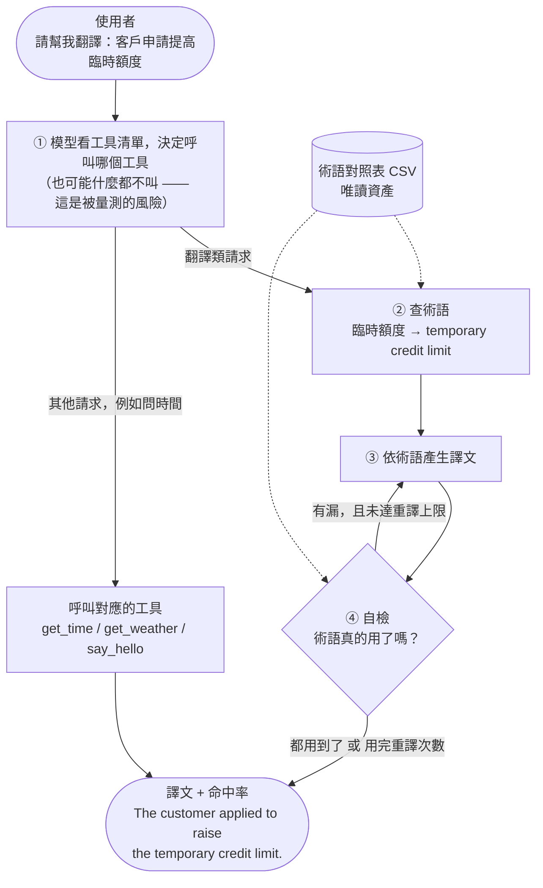
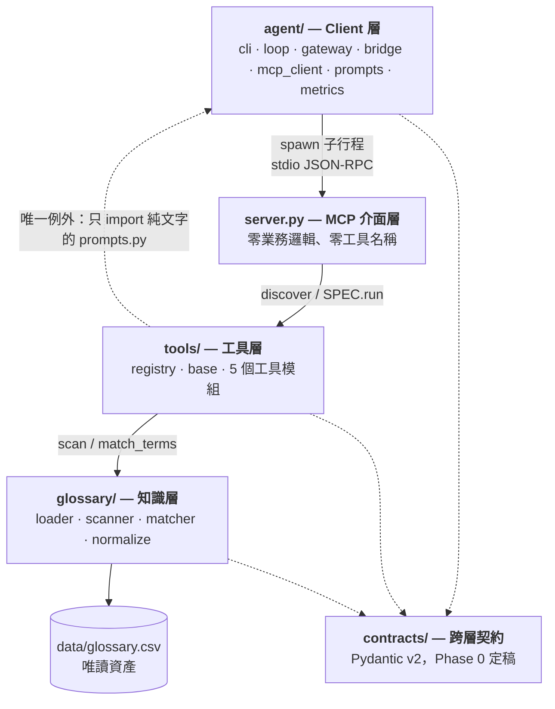

# 翻譯 Agent + 術語 MCP

通用 tool-calling agent，模型走 gateway（OpenAI 相容），工具以 stdio MCP server 掛在 client 端。
術語翻譯是其中一組工具，不是唯一的一組——加工具不需要動 `server.py`，也不需要動 system prompt。

Phase 0～3 已全數完成，12 條驗收條件都有對應的自動化測試。

```bash
python -m venv .venv && .venv/bin/pip install -e ".[dev]"

# 不需要任何憑證即可跑完整流程（走內建的 rule-based double）
.venv/bin/python -m agent.cli --gateway fake "請幫我翻譯：客戶申請提高臨時額度"

# 接真實 gateway
cp .env.example .env   # 填入 GATEWAY_BASE_URL / GATEWAY_API_KEY / GATEWAY_MODEL
.venv/bin/python -m agent.cli "請幫我翻譯：客戶申請提高臨時額度"
```

```
Regarding the request: temporary credit limit.
[turns=2 tool_calls=1 tools=lookup_terms retranslations=0 stop=completed]
[glossary hit rate 100%]
  HIT   臨時額度 → temporary credit limit (found: temporary credit limit)
```

---

## 0. 它在做什麼



**第 ① 步是風險所在**：離線實驗顯示模型有查術語是 98.1% / 99.0%，沒查是 42.7% / 49.7%。
所以「模型有沒有呼叫工具」被列為量測指標，不是假設。

> 完整的架構圖與流程圖（共 11 張）在 **[`docs/architecture.md`](docs/architecture.md)**。

## 1. 分層與權責



> **glossary 不知道 MCP 存在；tools 不知道 gateway 存在；agent 不知道對照表怎麼比對。**

唯一一條刻意的例外：`tools/translate_lookup.py` 會 import `agent/prompts.py` 的
`format_glossary_block`。`prompts.py` 是純文字模組（只 import `contracts`，由
`tests/test_prompts.py::TestPromptsModuleIsPure` 用 AST 檢查強制），這樣 glossary
區塊只有一份 renderer，改格式不會變成改 tool schema。

## 2. 五個工具

| 工具 | 形狀 | 說明 |
|---|---|---|
| `lookup_terms` | 有參數 | 從中文問句找出術語，回傳結構化 matches + 現成的 glossary block |
| `verify_translation` | 有參數 | 判定譯文是否命中術語，回傳 HIT / WRONG / MISS |
| `get_time` | 無參數 | 報時 |
| `say_hello` | 有參數、無副作用 | 問候 |
| `get_weather` | 有外部依賴 | 天氣；預設 `stub`，不對外連線 |

後三個構成工具註冊機制的測試矩陣：**無參數 / 有參數 / 有外部依賴**。

現階段所有工具皆唯讀無副作用，**server 層刻意不做確認機制**。等真的出現寫入類工具再設計，
不對想像中的工具預先設計。

### 加一個工具

新增一個檔案到 `tools/`，裡面放一個 `SPEC`：

```python
from tools.base import ToolSpec, object_schema

SPEC = ToolSpec(
    name="my_tool",
    description="說明什麼時候該呼叫它——這是模型唯一的路由依據。",
    input_schema=object_schema({"x": {"type": "string", "description": "..."}}, required=["x"]),
    handler=lambda args: {"ok": True},
)
```

就這樣。不用改 `server.py`、不用改 system prompt、不用註冊到任何清單。
這條設計主張由驗收條件 6 自動驗證：測試會實際寫入一個新工具檔、重啟 server、確認工具出現，
並比對 `server.py` 與 `agent/prompts.py` 的 SHA-256 沒有改變。

## 3. 核心設計決策

| 決策 | 選擇 | 理由 |
|---|---|---|
| 關鍵詞掃描 | 最長匹配優先，被長詞區間覆蓋的短詞不注入 | `額度 / 臨時額度 / 永久額度` 的譯法互相矛盾，同時注入等於給模型兩個打架的指令 |
| 命中判定 | 線上線下共用 `glossary/matcher.py` | 避免線下測得過、線上判不過 |
| 判定精度 | 被更長的重疊術語「吞掉」的 span 不算命中 | 把 `額度` 譯成 "temporary credit limit" 是**用錯術語**，不是用對了 |
| 工具清單 | 不寫進 system prompt | 加工具不必改 prompt |
| 回傳格式 | 結構化 + 現成區塊並存 | 程式要 offsets，模型要現成文字 |
| 自檢重譯 | 由 `agent/loop.py` 決策，不由工具決定 | 工具保持無狀態、可獨立測試 |
| 自檢觸發條件 | 看**模型實際呼叫了什麼工具**，不看使用者措辭 | 不做關鍵字嗅探，agent 才保持通用 |
| 對照表更新 | 每次存取比對 `(mtime_ns, size)` | 更新時間不定；載入一次會靜默地供應舊譯法 |
| 對照表壞掉 | 保留舊的可用版本，記一次 log | 壞掉的編輯降級成「過時」，不是「掛掉」 |

## 4. 驗收條件對照表

全部可自動驗證。`pytest tests/` 全綠即代表下表全數通過。

| # | 條件 | 測試 |
|---|---|---|
| 1 | 最長優先生效，不得出現「額度」 | `test_phase1.py::TestCriterion1LongestMatchFirst` |
| 2 | ≤3 回合、工具呼叫 1 次 | `TestCriterion2LoopBudget` |
| 3 | 端到端譯文經 matcher 判定 HIT | `TestCriterion3EndToEndTranslationHits` |
| 4 | 模型未呼叫工具時不中斷並記錄 | `TestCriterion4NoToolCallIsSurvivable` |
| 5 | 10 句 fixture，選對工具 ≥90% | `TestCriterion5ToolSelection` |
| 6 | 加空殼工具檔即出現，未改 server/prompt | `TestCriterion6Pluggability` |
| 7 | 改 CSV 不重啟即生效 | `TestCriterion7GlossaryReloadWithoutRestart` |
| 8 | 重譯後命中率提高（20 句） | `test_phase2.py::TestCriterion8RetranslationRaisesHitRate` |
| 9 | 重譯上限生效、不無限迴圈 | `TestCriterion9RetranslationCap` |
| 10 | 全術語端到端命中率 ≥98% | `test_phase3.py::TestCriterion10GlossaryHitRate` |
| 11 | 5 個工具時選對率仍 ≥90% | `TestCriterion11RoutingAtFiveTools` |
| 12 | 工具呼叫率列入報表 | `TestCriterion12ToolCallRateIsReported` |

### 關於 5、10、11 這三條

這三條問的是**模型行為**，不是程式行為。它們各有兩個版本：

- **harness 版**：永遠執行，用 `agent/testing.py` 的 deterministic double，證明「量測本身是對的」
  （條件 5 另外附一個反向測試，確認這個指標**有能力失敗**）。
- **model 版**：只有設定了 `GATEWAY_BASE_URL` 才執行，否則 **skip**。

沒有 gateway 時這三條會顯示 skipped——**不會用假資料填數字**。模擬出來的路由正確率是一個
長得像證據但不是證據的數字。要取得真正的數字：

```bash
GATEWAY_BASE_URL=... GATEWAY_API_KEY=... GATEWAY_MODEL=... \
  .venv/bin/python -m evals.run_eval --suite all
```

## 5. 評測

```bash
python -m evals.run_eval --suite all           # 需要 gateway
python -m evals.run_eval --suite routing --gateway fake --limit 4
```

| suite | 驗收條件 | 問題 |
|---|---|---|
| `routing` | 5, 11 | 模型會不會選對工具？ |
| `translation` | 8, 12 | 自檢迴圈有沒有把命中率拉起來？ |
| `glossary` | 10 | 每個術語端到端跑一次，命中率多少？ |

`glossary` suite 直接從對照表產生測資，所以把 `GLOSSARY_CSV` 指向正式的 379 詞資產，
測資規模自動跟著長，不必改程式。

報表落在 `evals/reports/`，含 `tool_call_rate`——離線實驗顯示模型若不呼叫工具，
品質會從 98% 掉到 43%，所以這個數字是頭條指標而不是診斷指標。

## 6. 設定

| 變數 | 預設 | 說明 |
|---|---|---|
| `GATEWAY_BASE_URL` | — | OpenAI 相容端點，**不含** `/chat/completions` |
| `GATEWAY_API_KEY` | — | |
| `GATEWAY_MODEL` | `fedgpt-medium` | |
| `GLOSSARY_CSV` | `data/glossary.csv` | 相對路徑以 repo root 為基準 |
| `AGENT_MAX_TURNS` | `6` | 整個 run 的回合上限 |
| `AGENT_MAX_RETRANSLATE` | `2` | 重譯次數上限（獨立預算） |
| `WEATHER_PROVIDER` | `stub` | `stub` 不連外網；`open-meteo` 需連外 |

## 7. 已知限制與未完成事項

1. **`data/glossary.csv` 是 71 詞的代表性樣本，不是正式的 379 詞資產。** 正式檔案不在此
   repository。樣本刻意涵蓋計畫點名的所有重疊詞族（`額度` 家族、`帳戶` 三層巢狀、
   `利率`、`外匯` 後綴重疊）。換成正式檔案不需要改任何程式碼，詳見 `data/README.md`。
2. **計畫提到要重用既有的 `term_eval.py`**（`normalize` / `expand_forms` / `compile_pattern` /
   `match_terms`）。該檔案不在此 repository，因此這些函式在 `glossary/normalize.py` 與
   `glossary/matcher.py` 中重新實作，並刻意設計成**單一實作**：離線評測應該 import
   `glossary.matcher.match_terms`，而不是自己複製一份。若既有 `term_eval.py` 之後併入，
   應改為 import 這裡的版本，而不是保留兩份。
3. **條件 5、10、11 的模型版本尚未執行過**——此環境沒有可用的 gateway。程式路徑本身
   已被 harness 版覆蓋。
4. **天氣資料來源仍待確認**（行內 API 或外部服務需審核）。因此 `get_weather` 預設
   `stub`，不會發出任何對外請求；決定之後只需新增一個 provider 函式。
5. 不做工具權限控管、多租戶、對話記憶、串流輸出、英翻中——皆為 by design 的 scope out。

## 8. 效能

379 詞 × 長問句的掃描成本先量測再決定要不要優化。目前 71 詞、290 字的問句是
**0.128 ms/scan**（`tests/test_scanner.py::TestPerformance` 會印出這個數字）。
單次編譯正則掃描，離需要 Aho-Corasick 還很遠。

## 9. 文件

- **[`docs/architecture.md`](docs/architecture.md)** — 架構圖與流程圖（11 張 Mermaid）
- `specs/001-glossary-core/spec.md` — 載入、mtime 重載、最長優先掃描、命中判定
- `specs/002-mcp-tools/spec.md` — 工具契約、自動註冊、五個工具的 schema
- `specs/003-agent-client/spec.md` — gateway、格式轉換、agent loop、prompts、CLI
- `data/README.md` — 對照表 schema 與換檔方式
- `CLAUDE.md` — 給後續維護者的注意事項
