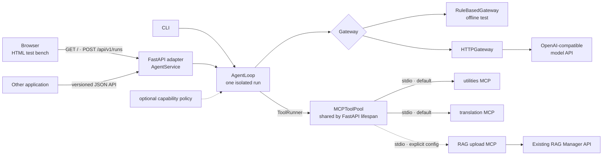
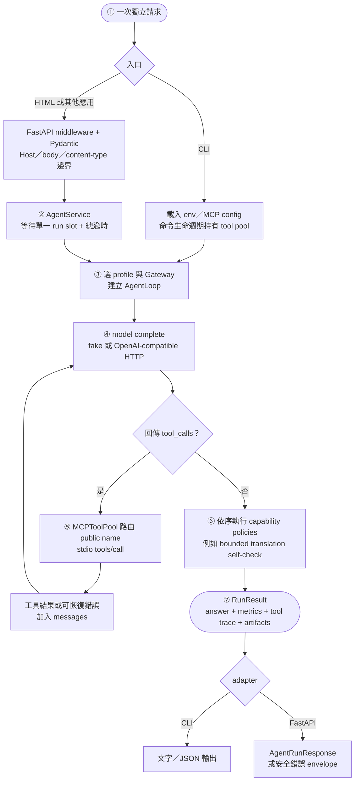
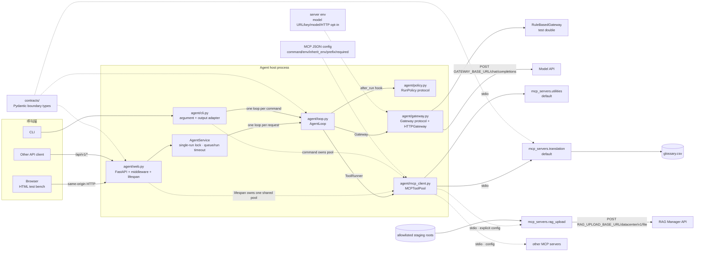
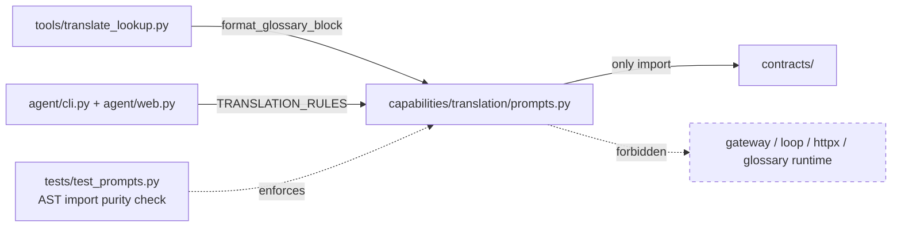
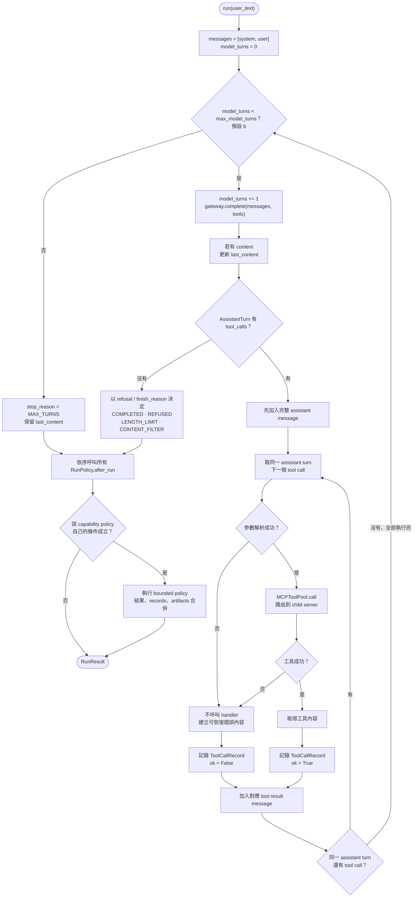
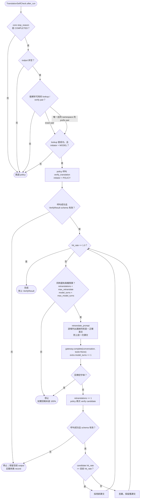
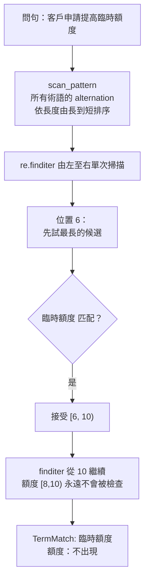
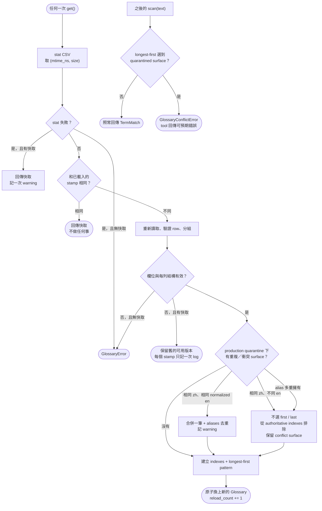
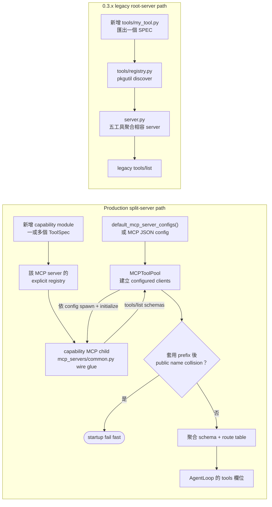

# 架構圖與流程圖

本文件同時描述兩條路徑：0.4 之後的 production 多 MCP 架構，以及仍受 regression tests
保護的 0.3.x legacy `server.py` 相容路徑。除非章節明確標示 legacy，下方的「現行流程」都指
CLI 或 FastAPI adapter 建立 `AgentLoop`、透過 `MCPToolPool` 聚合隔離的 MCP server。

快速總覽：Agent HTTP 服務、模型 API 與 RAG Manager 是三個不同端點；RAG upload server
不是預設能力，必須由部署者透過 MCP JSON config 明確啟用。



核心依賴方向：`agent/loop.py` 只依賴 `Gateway`、`ToolRunner`、`RunPolicy` 三個通用介面；
翻譯 prompt/policy 位於 `capabilities/translation/`；各 server 透過 `mcp_servers/common.py`
共用 MCP wire glue。RAG server 是手寫 HTTP adapter，不包含任何外部 RAG repository 的程式。

| # | 圖 | 回答什麼問題 |
|---|---|---|
| 1 | [高階流程](#1-高階流程圖) | 一次 CLI／API 請求如何變成結果？ |
| 2 | [系統架構](#2-系統架構圖) | 誰擁有生命週期、Gateway 與 MCP 邊界？ |
| 3 | [服務與端到端序列](#3-服務生命週期與端到端流程圖) | FastAPI 如何啟動、執行請求與處理外部 HTTP？ |
| 4 | [Agent Loop](#4-agent-loop-流程圖) | 回合怎麼算？工具失敗怎麼辦？ |
| 5 | [翻譯 policy](#5-自檢重譯決策流程) | 什麼時候驗證／重譯？為什麼不會無限迴圈？ |
| 6 | [最長優先掃描](#6-術語掃描最長優先) | 為什麼「臨時額度」會壓過「額度」？ |
| 7 | [命中判定](#7-命中判定hit--wrong--miss) | HIT / WRONG / MISS 怎麼分？ |
| 8 | [對照表重載](#8-對照表-mtime-重載) | 改了 CSV 為什麼不用重啟？ |
| 9 | [能力註冊與聚合](#9-能力註冊與多-mcp-聚合) | 新能力如何加入 production pool？legacy 自動註冊保留在哪？ |
| 10 | [契約流向](#10-契約流向) | 哪個型別跨過哪條邊界？ |

---

## 1. 高階流程圖

30 秒版本。CLI、網頁與其他應用共用同一個 capability-neutral loop；差別只在 adapter
如何驗證輸入、管理生命週期與輸出 envelope。



模型可以不呼叫任何工具；這是正常、可量測的結果。翻譯 profile 只有在模型成功呼叫
`lookup_terms` 後才可能執行術語 policy，generic profile 不會把翻譯規則塞進 core。

---

## 2. 系統架構圖

### 2.1 分層依賴圖

實線代表 runtime 呼叫或持有關係；虛線代表設定、資料或可選 policy。FastAPI 與 CLI 是
兩個 adapter，但最後都只把 `Gateway` 與 `ToolRunner` 交給同一個 `AgentLoop`。



### 2.2 模組職責

| 層 | 模組 | 負責 | 明確不負責 |
|---|---|---|---|
| **entry adapters** | `agent/cli.py` | 載入 env、選 profile/Gateway、管理 command-lifetime pool、渲染輸出 | HTTP 契約、工具實作 |
| | `agent/web.py` | FastAPI lifespan、middleware、版本化 API、HTML test bench、排隊與總逾時 | Agent／工具業務邏輯 |
| **agent core** | `agent/loop.py` | model → tool → model、多輪預算、通用 policy hooks、`RunResult` | capability-specific 判定 |
| | `agent/gateway.py` | OpenAI-compatible HTTP、URL/timeout/明文 opt-in 驗證、response drift normalization | 工具語意、API caller 認證 |
| | `agent/tooling.py` | `ToolRunner` protocol 與一致的 invocation error | MCP process 細節 |
| | `agent/policy.py` | `RunPolicy`／`PolicyContext`／`PolicyOutcome` | 翻譯或 RAG 規則 |
| | `agent/bridge.py` | MCP schema ↔ OpenAI tools/messages | domain 邏輯 |
| | `agent/metrics.py` | 評測報表彙總 | 線上 verdict 實作 |
| **MCP host** | `agent/mcp_config.py` | 驗證 server command、env allowlist、prefix、required | capability policy |
| | `agent/mcp_client.py` | spawn、initialize/list/call timeout、聚合 public names、collision check、最小 child env | 模型路由決策 |
| **capabilities/** | `translation/prompts.py` | 翻譯規則、glossary block 與 repair prompt 純文字 renderer | Gateway、HTTP、MCP session |
| | `translation/policy.py` | 成功 lookup 後的 bounded verify/repair | generic loop 控制流 |
| **MCP servers** | `mcp_servers/common.py` | 明確 registry → MCP list/call wire glue | 工具 domain 邏輯 |
| | `mcp_servers/utilities.py` | 預設 utility capability registry | translation／RAG |
| | `mcp_servers/translation.py` | 預設 translation capability registry | upload／模型呼叫 |
| | `mcp_servers/rag_upload/` | 檔案邊界、immutable snapshot、RAG multipart adapter | indexing 完成保證 |
| **legacy** | `server.py` | 0.3.x 五工具聚合相容與 regression tests | production 預設啟動路徑 |
| **tools/** | `registry.py` | legacy root server 掃描 `tools/` | split-server production registry |
| | `base.py` | `ToolSpec` 契約與 argument 驗證 | MCP transport |
| | 各工具模組 | 單一 handler，自帶 name/description/schema | Gateway、Agent loop |
| **glossary/** | `loader.py` | 讀 CSV、展開別譯、預編譯、mtime 重載 | 掃描、判定 |
| | `scanner.py` | 從中文問句找術語（最長優先） | 格式化、翻譯 |
| | `matcher.py` | 判定譯文是否命中（唯一實作） | 決定要不要重譯 |
| | `normalize.py` | 正規化、英文詞形展開、樣式編譯 | 決定要找什麼 |
| **contracts/** | `contracts/api.py`、`agent.py`、`tools.py` | HTTP、run、tool result 的跨層型別 | process lifecycle |

### 權責一句話

> **glossary 不知道 MCP 存在；tools 不知道 gateway 存在；agent 不知道對照表怎麼比對。**

再加兩條 deployment 邊界：Gateway credential 只留在 Agent host；MCP child 預設只收到 runtime
allowlist 與該 server 明列的 `inherit_env`。`GATEWAY_API_KEY` 和
`GATEWAY_ALLOW_INSECURE_HTTP` 都不會自動流入任何 MCP server。

### 純文字 renderer 的刻意共享

`tools/translate_lookup.py` 與 translation profile adapter 共用
`capabilities/translation/prompts.py`。這條依賴之所以被允許，只因為該模組是純文字 renderer：
只 import `contracts`，沒有 gateway、HTTP、MCP session 或 glossary runtime。



`agent/prompts.py` 仍是 generic system prompt 的純文字模組；兩個 prompt modules 都由 AST test
限制 import。工具名稱仍只經 API 的 `tools` 欄位進模型，不寫死在 generic system prompt。

---

## 3. 服務生命週期與端到端流程圖

FastAPI 在 lifespan 只建立一個共享 pool；每個 request 則建立自己的 Gateway、messages 與
`AgentLoop`。CLI 不經 HTTP adapter，但同樣使用 pool → stdio MCP 的路徑。

```mermaid
sequenceDiagram
    autonumber
    actor C as Browser / API caller
    participant API as FastAPI adapter
    participant SVC as AgentService
    participant POOL as shared MCPToolPool
    participant MCP as selected MCP server
    participant AL as isolated AgentLoop
    participant TP as TranslationSelfCheck
    participant GW as selected Gateway
    participant MODEL as Model API
    participant GLOSS as glossary runtime
    participant RAGM as RAG Manager API

    Note over API,MCP: Application startup — lifespan owns the pool
    API->>API: load default or explicit MCP config
    API->>POOL: enter pool(config)
    Note over POOL,MCP: Default: utilities + translation; RAG requires explicit config
    POOL->>MCP: spawn stdio + initialize + tools/list
    MCP-->>POOL: tool schemas
    POOL-->>API: aggregated public catalog

    C->>API: POST /api/v1/runs
    API->>API: middleware + Pydantic boundary checks
    API->>SVC: AgentRunRequest
    SVC->>SVC: queue timeout → acquire single-run lock
    SVC->>GW: create fake or HTTP gateway from server config
    SVC->>AL: run one loop with shared pool
    Note over SVC,AL: The whole loop is bounded by the configured run timeout

    loop Model turns within max_model_turns
        AL->>GW: complete(messages, aggregated tools)
        opt HTTPGateway
            GW->>MODEL: POST GATEWAY_BASE_URL/chat/completions
            MODEL-->>GW: assistant content / tool_calls
        end
        GW-->>AL: normalized AssistantTurn

        alt Assistant returned tool_calls
            loop Every call in this assistant turn
                AL->>POOL: call(public_name, arguments)
                POOL->>MCP: stdio tools/call(remote_name)
                alt translation capability
                    MCP->>GLOSS: lookup / verify
                    GLOSS-->>MCP: structured result
                else explicitly enabled RAG upload
                    MCP->>RAGM: POST RAG_UPLOAD_BASE_URL/datacenter/v1/file
                    RAGM-->>MCP: upstream response or transport failure
                    MCP->>MCP: validate receipt or normalize a safe tool error
                else utility / custom server
                    MCP->>MCP: run registered ToolSpec
                end
                MCP-->>POOL: MCP result
                POOL-->>AL: content or recoverable invocation error
            end
        else Terminal assistant turn
            AL->>AL: map finish reason to stop_reason
        end
    end

    opt translation profile and eligible successful lookup
        AL->>TP: after_run(PolicyContext)
        TP->>POOL: policy call verify_translation
        POOL-->>TP: VerifyResult or invocation error
        opt bounded repair is needed
            TP->>GW: complete(repair conversation, tools=None)
            GW-->>TP: candidate translation
            TP->>POOL: verify candidate
            POOL-->>TP: candidate VerifyResult
        end
        Note over TP,GW: Repairs share the remaining model-turn budget
        TP-->>AL: bounded PolicyOutcome
    end

    AL-->>SVC: RunResult
    SVC->>GW: close per-request gateway
    SVC->>SVC: release lock
    SVC-->>API: AgentRunResponse
    API-->>C: JSON envelope

    Note over API,POOL: Application shutdown — close all child sessions once
```

圖中有三條互不相同的 HTTP：呼叫端進 `/api/v1/runs`、Agent host 往
`GATEWAY_BASE_URL/chat/completions`、以及可選 RAG MCP 往
`RAG_UPLOAD_BASE_URL/datacenter/v1/file`。MCP host 與 child server 之間目前是 stdio，並非 HTTP。

---

## 4. Agent Loop 流程圖

回合怎麼算、工具壞掉怎麼辦、模型不呼叫工具怎麼辦。



### 三個刻意的設計

| 情況 | 行為 | 為什麼 |
|---|---|---|
| 一般回答且沒有 tool calls | **正常完成**，`called_any_tool = False` | 不假設每個問題都需要工具；是否呼叫仍必須量測 |
| 無 tool calls，但 finish reason 不是一般完成 | 記為 `REFUSED`／`LENGTH_LIMIT`／`CONTENT_FILTER` | 「沒有工具」不代表模型正常回答，terminal reason 必須保留 |
| 同一回合要求多個工具 | **全部依序執行**後才再次呼叫模型 | assistant message 與每個 tool result 必須成套，不能漏掉後面的 call |
| 工具丟出錯誤 | 錯誤訊息回給模型，讓它自己補救 | 一個壞掉的工具不該讓整個 run 死掉 |
| 參數是壞掉的 JSON | **不呼叫工具**，直接回錯誤 | gateway 格式差異不該變成 handler 的例外 |

總 model-turn 預算是所有模型呼叫的硬邊界；每個 capability 還可以有更小的自身上限。
耗盡是一個**被記錄的正常結果**，最後一段文字仍會回傳。所有 policy 都會收到 hook，但可以依
`completed`、工具紀錄與輸出內容自行拒絕執行。

---

## 5. 自檢重譯決策流程

`verify_translation` 只回報；決策者是
`capabilities/translation/policy.py::TranslationSelfCheck`。`AgentLoop` 只提供通用 hook、剩餘
預算與 invocation function，讓工具保持無狀態、core 保持 capability-neutral。



### 為什麼觸發條件看成功紀錄，而不是問句裡有沒有「翻譯」

看**模型實際成功做了什麼**，不看使用者措辭。失敗的 lookup、policy 自己發起的 call、跨
namespace 的工具拼接，以及非正常完成的 core run 都不構成驗證依據。不做關鍵字嗅探，agent
才保持通用；未來的能力要自檢就寫自己的 policy，不需要在 core 加一條 `if`。

### 為什麼終止的保證來自上限而不是模型的進步

一個一直回傳同樣譯文的模型，`hit_rate` 永遠不變。如果只用「沒有進步就停」當條件，
`>=` 會一直成立而永遠不停。**總 model-turn 預算與 `max_retranslate`，不是進步，保證了終止**。
較差 candidate 不會覆蓋目前譯文，但只要兩種預算都還有剩餘，policy 仍可做下一次 bounded repair。

---

## 6. 術語掃描：最長優先



**那個排序本身就是演算法。** `Glossary.scan_pattern` 是一個依 surface 長度由長到短排序的
alternation；因為 `finditer` 匹配後會跳過整段，巢狀在裡面的短詞根本不會被重新檢查。

| 輸入 | 接受 | 被壓過 |
|---|---|---|
| `客戶申請提高臨時額度` | `臨時額度` | `額度` |
| `永久額度和臨時額度` | `永久額度`, `臨時額度` | `額度` ×2 |
| `警示帳戶通報機制` | `警示帳戶通報機制` | `警示帳戶`, `帳戶` |
| `外幣帳戶的牌告利率` | `外幣帳戶`, `牌告利率` | `帳戶`, `利率` |
| `額度與臨時額度` | `額度`, `臨時額度` | 無 —— 壓制是**依區間**不是依詞 |

**為什麼要這樣做**：對照表裡 `額度 / 臨時額度 / 永久額度` 這種家族，短詞的英文對長詞來說是
**錯的**，不只是比較不精確。同時注入兩者，等於對同一段文字給模型兩個互相矛盾的指令 ——
實測比兩個都不給還糟。

---

## 7. 命中判定：HIT / WRONG / MISS

**這是全系統唯一的判定實作**（`glossary/matcher.py`）。離線評測與線上 `verify_translation`
共用同一個函式；複製一份出去會產生一種在使用者面前才會現形的 bug。


### swallowed span：這條規則抓到的實際 bug

`額度` 展開成 `credit limit`，而它也是 `temporary credit limit` 的子字串。若不處理，
把 `額度` 譯成 "temporary credit limit" 會判成 **HIT** —— 系統對「用錯術語」完全盲目，
而那正是這一層存在的理由。這個問題是 golden fixture 抓出來的。

| 原文術語 | 譯文 | 判定 |
|---|---|---|
| `臨時額度` | "…the temporary credit limit." | HIT |
| `臨時額度` | "…the credit limit." | WRONG（`credit limit`）|
| `額度` | "Insufficient temporary credit limit." | WRONG（`temporary credit limit`）|
| `額度` | "There are limitations…" | MISS |

規則是對稱的：兩個方向都判對，而且不需要知道兩者之中哪一個才是「真正的那個」。

---

## 8. 對照表 mtime 重載

公開的 `load_glossary()`／`GlossaryLoader` 預設維持 strict：任何重複 canonical `zh` 都報錯。
process-wide production runtime 明確採 `conflict_policy="quarantine"`，讓資料問題只影響有歧義的
surface，而不是讓無關的 `lookup_terms` 全部失效。



| 決策 | 理由 |
|---|---|
| 每次存取都 stat，而不是啟動時載入一次 | 對照表更新時間不定。長時間運行的 server 會**靜默地**供應舊譯法 —— 靜默才是真正的危險 |
| 不做推送 / webhook 失效機制 | 目前 71 詞、正式 379 詞，重載是次毫秒等級。任何失效協定的維運成本都高於它省下的東西 |
| stamp 同時看 size，不只看 mtime | 某些檔案系統 mtime 只到秒；同一秒內的編輯會被藏起來 |
| 結構解析失敗保留舊版本 | 缺欄、空必填值等壞編輯降級成「過時」，不是「掛掉」 |
| production 隔離衝突詞 | 無關詞仍可查；真正碰到歧義時明確失敗，絕不依 row order 猜譯法 |
| strict API 仍預設拒絕 duplicate | 資料驗證／CI 可以維持 fail-fast；只有 runtime 明確選擇 availability policy |
| `RLock` 保護 | 並行讀取只會看到舊的或新的 `Glossary`，不會看到蓋到一半的 |

CSV 的 `aliases` 欄仍是 `|` 分隔的**中文來源別名**，不是可接受的英文同義詞；額外欄位不會
偷偷改變 matcher 語意。若同一中文詞確實需要依 category 使用不同英文，現行
`lookup_terms(text)` 沒有足夠的 disambiguation 維度，資料必須先拆成可判別的 source surface，
或另行擴充帶 context/category 的契約。

---

## 9. 能力註冊與多 MCP 聚合

Production 與 legacy 有兩種刻意不同的擴充路徑。新 domain capability 採明確 registry 與設定；
「加一個檔案就自動出現」只屬於 0.3.x root-server 相容路徑。



預設 production config 只列 `mcp_servers.utilities`（`say_hello`、`get_time`、`get_weather`）與
`mcp_servers.translation`（`lookup_terms`、`verify_translation`）；
`mcp_servers.rag_upload` 的 `upload_document` 因為有外部寫入副作用，必須由部署者在 JSON config
明確加入。每個 child process 只得到最小 runtime env、server 固定 `env` 與逐項
`inherit_env`，pool 再處理 timeout、optional server、prefix 與 collision。

### Legacy 自動註冊仍有 regression test

驗收條件 6（`tests/acceptance/test_phase1.py::TestCriterion6Pluggability`）仍會實際新增一個
`tools/probe_tool.py`、啟動 legacy `server.py`、驗證可 list/call，再刪除檔案並確認
`server.py` 與 generic `agent/prompts.py` 的 SHA-256 沒變。這保護舊相容承諾，但不代表新
production capability 應塞回 root server。

### Description 仍承擔 model routing 責任

無論是哪一條註冊路徑，generic system prompt 都不列舉工具；模型看到的是 API `tools` 欄位。
因此每個 `ToolSpec.description` 必須說清楚**何時呼叫、何時不要呼叫與副作用**。工具 catalog
變大後若 routing 準確率下降，先量測 description／capability selection，而不是把 domain 名稱
硬寫進 `AgentLoop`。

---

## 10. 契約流向

`contracts/` 是跨層資料契約的集中處；process lifecycle、stdio transport 與外部 HTTP 則由各
adapter 擁有。圖中的 RAG branch 是獨立 capability，不依賴 glossary contract。

```mermaid
flowchart LR
    subgraph TRANS["Translation capability contracts"]
        CSV[("glossary.csv")] -->|GlossaryEntry| LOADER["glossary/loader.py"]
        LOADER -->|Glossary| SCAN["glossary/scanner.py"]
        SCAN -->|"TermMatch[]"| LOOKUP["lookup_terms ToolSpec"]
        SCAN -->|"TermMatch[]"| MATCHER["glossary/matcher.py"]
        MATCHER -->|"TermVerdict[]"| VERIFY["verify_translation ToolSpec"]
        LOOKUP -->|LookupResult| TSERVER["mcp_servers/translation.py"]
        VERIFY -->|VerifyResult| TSERVER
    end

    POOL["MCPToolPool"] -->|"stdio tools/call"| TSERVER
    TSERVER -->|"stdio schemas + results"| POOL
    UTIL["utilities MCP"] -->|"stdio schemas + results"| POOL
    POOL -->|"stdio tools/call"| UTIL
    POOL -->|"schema + tool content"| BRIDGE["agent/bridge.py"]
    BRIDGE --> LOOP["AgentLoop"]
    LOOP -->|"public tool name + arguments"| POOL

    LOOP -->|RunResult| CLI["agent/cli.py"]
    LOOP -->|RunResult| EVAL["evals/"]
    EVAL -->|Report| REPORT[("evals/reports/*.json")]
    LOOP -->|RunResult| SVC["AgentService"]
    REQ["AgentRunRequest"] --> SVC
    SVC -->|AgentRunResponse| API["FastAPI /api/v1/runs"]
    API --> CALLER["Browser / other application"]

    subgraph RAGBRANCH["Optional, independent RAG capability"]
        RAG["mcp_servers/rag_upload"] -->|"multipart POST"| RAGAPI["RAG Manager API"]
        RAGAPI -->|"upstream receipt"| RAG
    end
    POOL -->|"stdio tools/call<br/>upload_document arguments"| RAG
    RAG -->|"safe stdio MCP result"| POOL
```



| 型別 | 跨過的邊界 | 為什麼長這樣 |
|---|---|---|
| `TermMatch` | glossary → tools | 帶 `start`/`end`，所以呼叫端可以自己決定要不要去重；alias 命中時回報正規 `zh`，但 span 指向實際寫的字 |
| `LookupResult` | tools → agent | `matches` 給程式、`glossary_block` 給模型 —— 兩種消費者不同，所以兩種形狀並存 |
| `VerifyResult` | tools → agent | 只回報，不決策 |
| `ToolCallRecord.initiator` | agent 內部 | 分開 `MODEL` 與 `POLICY`：自檢的 verify 呼叫是真的，但它**不是模型選了工具的證據**，所以不計入工具呼叫率 |
| `RunResult` | agent → CLI / evals / AgentService | 同一個 core 結果可由不同 adapter 渲染或包裝 |
| `AgentRunRequest` / `AgentRunResponse` | FastAPI caller ↔ AgentService | 版本化 HTTP envelope 不滲入 core loop；API key 與 insecure-HTTP opt-in 不在 request contract |
| RAG upload arguments / safe result | AgentLoop／pool ↔ RAG MCP ↔ RAG Manager | 表達接受 upload job，不承諾 parse/index 已完成，也不與 translation contract 混用 |

---

## 延伸閱讀

- `specs/001-glossary-core/spec.md` —— 載入、mtime 重載、最長優先掃描、命中判定
- `specs/002-mcp-tools/spec.md` —— 工具契約、自動註冊、五個工具的 schema
- `specs/003-agent-client/spec.md` —— gateway、格式轉換、agent loop、prompts、CLI
- `README.md` —— 啟動方式、FastAPI 契約、MCP 設定與部署安全邊界
