# 架構圖與流程圖

本文件是 `specs/001~003` 的視覺化補充。**規格以 spec 為準**；這裡畫的是同一套設計，
方便快速建立整體圖像。所有圖為 Mermaid，GitHub 可直接渲染。

| # | 圖 | 回答什麼問題 |
|---|---|---|
| 1 | [高階流程](#1-高階流程圖) | 這東西到底在做什麼？ |
| 2 | [系統架構](#2-系統架構圖) | 有哪幾層？誰可以依賴誰？ |
| 3 | [端到端序列](#3-端到端流程圖) | 一次翻譯請求實際跑過哪些元件？ |
| 4 | [Agent Loop](#4-agent-loop-流程圖) | 回合怎麼算？工具失敗怎麼辦？ |
| 5 | [自檢重譯](#5-自檢重譯決策流程) | 什麼時候重譯？為什麼不會無限迴圈？ |
| 6 | [最長優先掃描](#6-術語掃描最長優先) | 為什麼「臨時額度」會壓過「額度」？ |
| 7 | [命中判定](#7-命中判定hit--wrong--miss) | HIT / WRONG / MISS 怎麼分？ |
| 8 | [對照表重載](#8-對照表-mtime-重載) | 改了 CSV 為什麼不用重啟？ |
| 9 | [工具自動註冊](#9-工具自動註冊可插拔) | 為什麼加工具不用改 server？ |
| 10 | [契約流向](#10-契約流向) | 哪個型別跨過哪條邊界？ |

---

## 1. 高階流程圖

30 秒版本。使用者丟一句中文，拿回一句英文，中間模型自己決定要不要查術語。

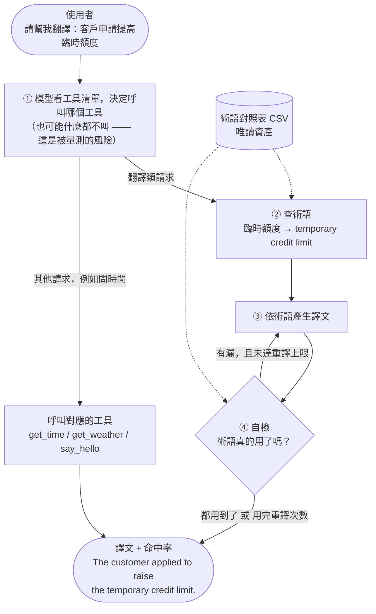

**為什麼第 ① 步是風險所在**：離線實驗顯示，模型有查術語是 98.1% / 99.0%，沒查是
42.7% / 49.7%。所以「模型有沒有呼叫工具」被列為量測指標，不是假設。

---

## 2. 系統架構圖

### 2.1 分層依賴圖

**實線箭頭代表「依賴」，方向只能由上往下。** 圖上只有一條往回的虛線，就是下面說明的那條例外。

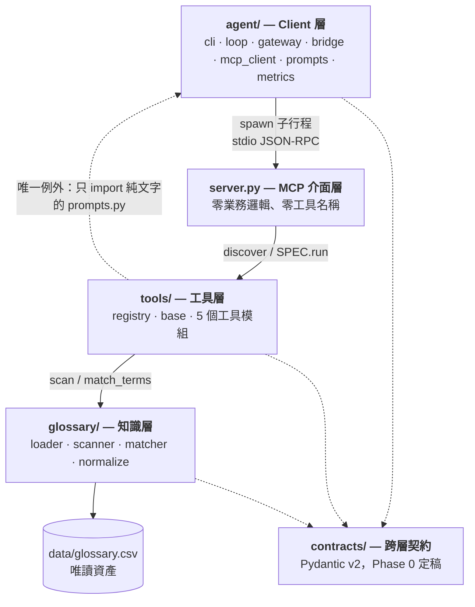

### 2.2 模組職責

| 層 | 模組 | 負責 | 明確不負責 |
|---|---|---|---|
| **agent/** | `cli.py` | 參數解析、輸出渲染 | 其他所有事 |
| | `loop.py` | 多輪編排、回合上限、自檢決策 | 工具內部行為 |
| | `gateway.py` | OpenAI 相容呼叫、格式差異吸收 | 工具語意 |
| | `bridge.py` | MCP schema ↔ OpenAI tools 格式 | 業務語意 |
| | `mcp_client.py` | spawn server、stdio 會話 | 選哪個工具 |
| | `prompts.py` | system prompt、模板、glossary 區塊 | 呼叫模型 |
| | `metrics.py` | 報表彙總 | 判定譯文 |
| **server.py** | — | 工具註冊、I/O 轉換、錯誤包裝 | 任何業務邏輯 |
| **tools/** | `registry.py` | 掃描 `tools/` 自動註冊 | 工具做什麼 |
| | `base.py` | `ToolSpec` 契約與驗證 | 協定細節 |
| | 各工具模組 | 一件事，自帶 name/description/schema | MCP 協定、gateway |
| **glossary/** | `loader.py` | 讀 CSV、展開別譯、預編譯、mtime 重載 | 掃描、判定 |
| | `scanner.py` | 從中文問句找術語（最長優先） | 格式化、翻譯 |
| | `matcher.py` | 判定譯文是否命中（唯一實作） | 決定要不要重譯 |
| | `normalize.py` | 正規化、英文詞形展開、樣式編譯 | 決定要找什麼 |

### 權責一句話

> **glossary 不知道 MCP 存在；tools 不知道 gateway 存在；agent 不知道對照表怎麼比對。**

任何一層若需要知道另一層的實作細節，就是切分錯了 —— 修切分，不要修症狀。

### 那條唯一例外（虛線）

`tools/translate_lookup.py` 會 import `agent/prompts.py` 的 `format_glossary_block`。
這條依賴之所以被允許，只因為 `prompts.py` 是**純文字模組**：它只 import `contracts`，
沒有 gateway、沒有 HTTP、沒有 loop。

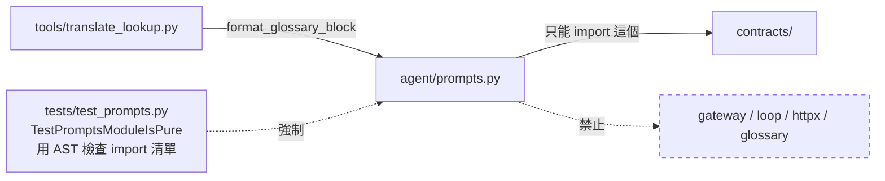

好處是 glossary 區塊只有**一份 renderer**：工具端與 prompt 端不可能長得不一樣，
而且改格式不會變成改 tool schema。

---

## 3. 端到端流程圖

一次翻譯請求，從 CLI 到譯文的完整序列。

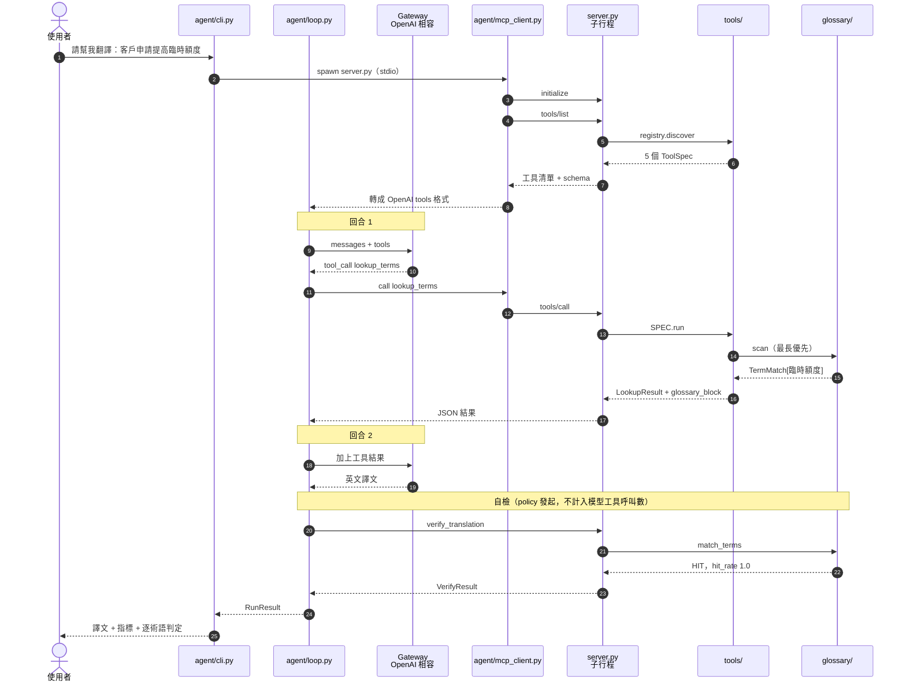

**注意第 ① 個關鍵設計**：system prompt 從頭到尾沒有出現任何工具名稱。工具清單走的是
API 的 `tools` 欄位（序列 7～8），也就是模型真正讀取的地方。

---

## 4. Agent Loop 流程圖

回合怎麼算、工具壞掉怎麼辦、模型不呼叫工具怎麼辦。

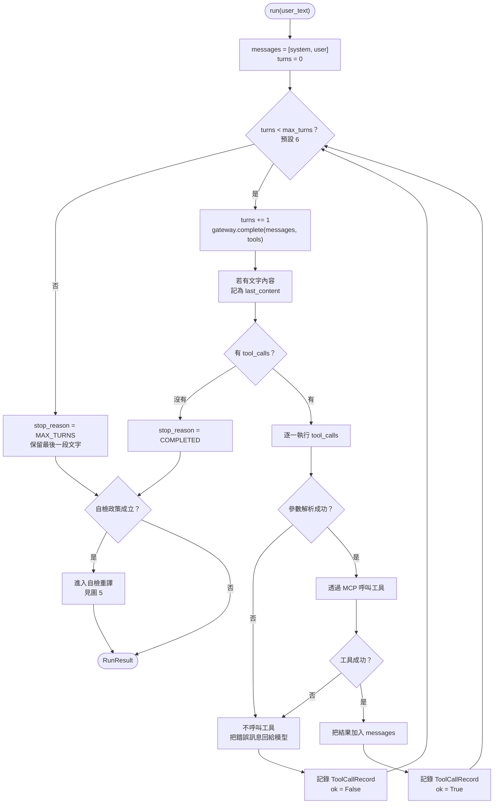

### 三個刻意的設計

| 情況 | 行為 | 為什麼 |
|---|---|---|
| 模型完全不呼叫工具 | **正常完成**，`called_any_tool = False` | 計畫拒絕假設模型會呼叫工具；拒絕假設的東西就必須量測 |
| 工具丟出錯誤 | 錯誤訊息回給模型，讓它自己補救 | 一個壞掉的工具不該讓整個 run 死掉 |
| 參數是壞掉的 JSON | **不呼叫工具**，直接回錯誤 | gateway 格式差異不該變成 handler 的例外 |

回合上限是唯一的硬邊界：耗盡是一個**被記錄的正常結果**，最後一段文字仍會回傳。

---

## 5. 自檢重譯決策流程

`verify_translation` 只回報，`agent/loop.py` 決策。這條切分讓工具保持無狀態、可獨立測試。

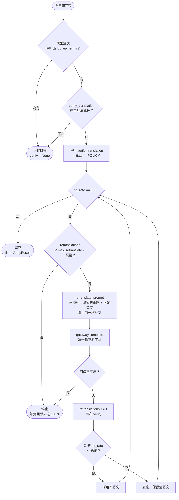

### 為什麼觸發條件是「呼叫過 lookup_terms」而不是「問句裡有『翻譯』」

看**模型實際做了什麼**，不看使用者措辭。不做關鍵字嗅探，agent 才保持通用 ——
未來的工具要自檢就寫自己的 policy，不需要在這裡加一條 `if`。

### 為什麼終止的保證來自上限而不是模型的進步

一個一直回傳同樣爛譯文的模型，`hit_rate` 永遠不變。如果用「沒有進步就停」當條件，
`>=` 會一直成立而永遠不停。**是預算，不是進步，保證了終止**（驗收條件 9）。

---

## 6. 術語掃描：最長優先

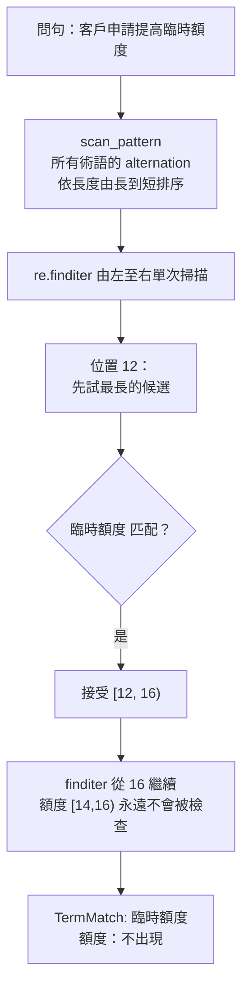

**那個排序本身就是演算法。** `Glossary.scan_pattern` 是一個依 surface 長度由長到短排序的
alternation；因為 `finditer` 匹配後會跳過整段，巢狀在裡面的短詞根本不會被重新檢查。

| 輸入 | 接受 | 被壓過 |
|---|---|---|
| `客戶申請提高臨時額度` | `臨時額度` | `額度` |
| `永久額度和臨時額度` | `永久額度`, `臨時額度` | `額度` ×2 |
| `警示帳戶通報機制` | `警示帳戶通報機制` | `警示帳戶`, `帳戶` |
| `外幣帳戶的牌告利率` | `外幣帳戶`, `牌告利率` | `帳戶`, `利率` |
| `額度與臨時額度` | `額度`, `臨時額度` | 無 —— 壓制是**依區間**不是依詞 |

**為什麼要這樣做**：對照表裡 `額度 / 臨時額度 / 永久額度` 這種家族，短詞的英文對長詞來說是
**錯的**，不只是比較不精確。同時注入兩者，等於對同一段文字給模型兩個互相矛盾的指令 ——
實測比兩個都不給還糟。

---

## 7. 命中判定：HIT / WRONG / MISS

**這是全系統唯一的判定實作**（`glossary/matcher.py`）。離線評測與線上 `verify_translation`
共用同一個函式；複製一份出去會產生一種在使用者面前才會現形的 bug。

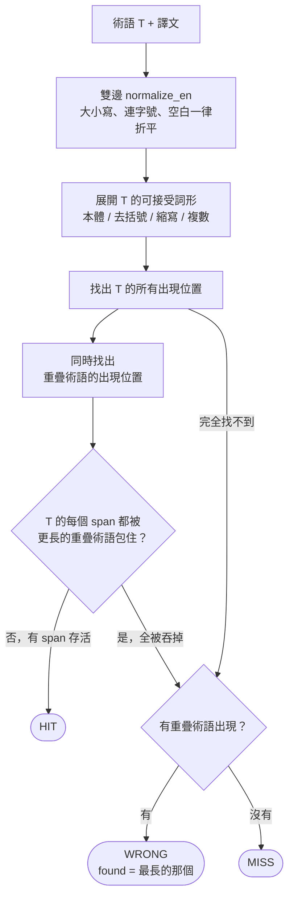

### swallowed span：這條規則抓到的實際 bug

`額度` 展開成 `credit limit`，而它也是 `temporary credit limit` 的子字串。若不處理，
把 `額度` 譯成 "temporary credit limit" 會判成 **HIT** —— 系統對「用錯術語」完全盲目，
而那正是這一層存在的理由。這個問題是 golden fixture 抓出來的。

| 原文術語 | 譯文 | 判定 |
|---|---|---|
| `臨時額度` | "…the temporary credit limit." | HIT |
| `臨時額度` | "…the credit limit." | WRONG（`credit limit`）|
| `額度` | "Insufficient temporary credit limit." | WRONG（`temporary credit limit`）|
| `額度` | "There are limitations…" | MISS |

規則是對稱的：兩個方向都判對，而且不需要知道兩者之中哪一個才是「真正的那個」。

---

## 8. 對照表 mtime 重載

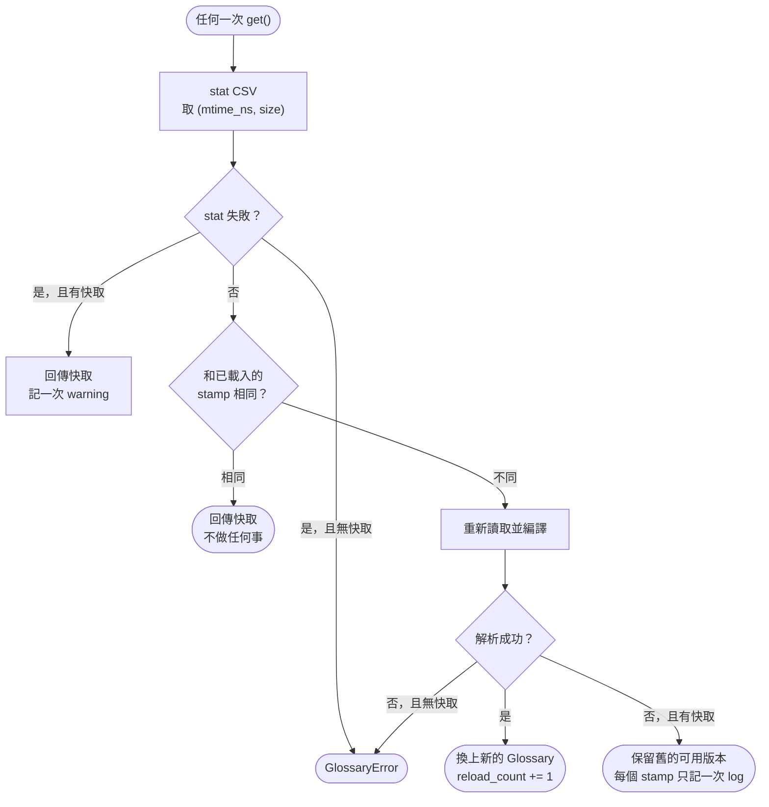

| 決策 | 理由 |
|---|---|
| 每次存取都 stat，而不是啟動時載入一次 | 對照表更新時間不定。長時間運行的 server 會**靜默地**供應舊譯法 —— 靜默才是真正的危險 |
| 不做推送 / webhook 失效機制 | 目前 71 詞、正式 379 詞，重載是次毫秒等級。任何失效協定的維運成本都高於它省下的東西 |
| stamp 同時看 size，不只看 mtime | 某些檔案系統 mtime 只到秒；同一秒內的編輯會被藏起來 |
| 解析失敗保留舊版本 | 壞掉的編輯降級成「過時」，不是「掛掉」 |
| `RLock` 保護 | 並行讀取只會看到舊的或新的 `Glossary`，不會看到蓋到一半的 |

---

## 9. 工具自動註冊（可插拔）

**加一個工具 = 加一個檔案。** 不改 `server.py`、不改 system prompt、不註冊到任何清單。

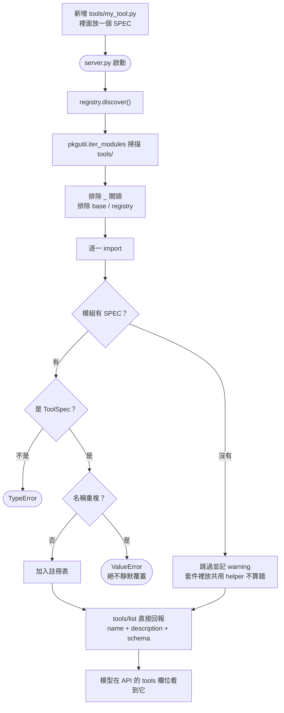

### 這條設計主張是被自動驗證的

驗收條件 6（`tests/acceptance/test_phase1.py::TestCriterion6Pluggability`）會：

1. 確認 `probe_tool` 一開始不存在
2. **實際寫入**一個新的工具檔到 `tools/`
3. 開一個新的 server 子行程（等同重啟）
4. 確認工具出現在清單裡，而且真的可以呼叫
5. 刪除檔案
6. 比對 `server.py` 與 `agent/prompts.py` 的 **SHA-256 沒有改變**

> 不能被測試的設計主張只是口號。這一條有測試。

### 代價：description 承擔全部路由責任

system prompt 是通用的、不列舉工具，所以 `description` 就是路由政策本身。
它必須寫「**什麼時候該呼叫它**」，而且要和兄弟工具區分開來：

- `get_time` 寫明「這是報時，不是把『時間』兩個字翻成英文」—— 因為 `服務時間` 是術語，兩個意圖會撞。
- `lookup_terms` 寫明「翻譯前先呼叫」—— 因為多呼叫一次的成本，遠低於漏呼叫一次。

工具變多之後路由正確率掉下來，修的是 description，一個檔案的區域性改動。

---

## 10. 契約流向

`contracts/` 在 Phase 0 定稿，是唯一一個「改動會同時影響多層」的地方。

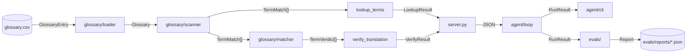

| 型別 | 跨過的邊界 | 為什麼長這樣 |
|---|---|---|
| `TermMatch` | glossary → tools | 帶 `start`/`end`，所以呼叫端可以自己決定要不要去重；alias 命中時回報正規 `zh`，但 span 指向實際寫的字 |
| `LookupResult` | tools → agent | `matches` 給程式、`glossary_block` 給模型 —— 兩種消費者不同，所以兩種形狀並存 |
| `VerifyResult` | tools → agent | 只回報，不決策 |
| `ToolCallRecord.initiator` | agent 內部 | 分開 `MODEL` 與 `POLICY`：自檢的 verify 呼叫是真的，但它**不是模型選了工具的證據**，所以不計入工具呼叫率 |
| `RunResult` | agent → CLI / evals | 同一個型別餵給人看的輸出和餵給報表 |

---

## 延伸閱讀

- `specs/001-glossary-core/spec.md` —— 載入、mtime 重載、最長優先掃描、命中判定
- `specs/002-mcp-tools/spec.md` —— 工具契約、自動註冊、五個工具的 schema
- `specs/003-agent-client/spec.md` —— gateway、格式轉換、agent loop、prompts、CLI
- `README.md` §4 —— 12 條驗收條件對照表
